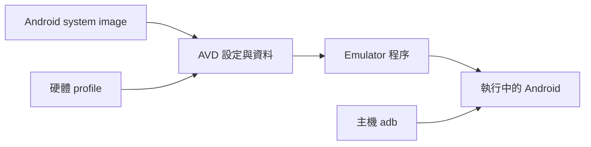

# Android 工具與執行環境

本文件說明 Android Environment v0.4.1 使用的工具，以及它們和 Android App 開發的關係。實際安裝步驟請見 [setup](./setup.md)。

## 工具分工

| 工具或元件 | 執行位置 | 用途 |
| --- | --- | --- |
| JDK | 工作站 | 提供 Java 工具的執行環境 |
| Android SDK | 工作站 | Android 工具、API 與映像檔的集合 |
| `sdkmanager` | 工作站 | 列出與安裝 SDK 套件 |
| `avdmanager` | 工作站 | 建立與管理 AVD |
| SDK Platform | 工作站 | 特定 API level 的平台檔案 |
| System image | 工作站上的 SDK 目錄 | Emulator 使用的 Android 系統映像 |
| AVD | 工作站 | 虛擬裝置設定與使用者資料 |
| Emulator | 工作站 | 執行 AVD 的程序 |
| `adb` | 工作站 | 連線到 Android 裝置上的 `adbd`，執行除錯指令 |
| `fastboot` | 工作站 | 和支援 fastboot 的裝置模式通訊 |

本 repo 安裝的 Platform Tools 包含 `adb` 與 `fastboot`，但目前 lifecycle scripts 使用 ADB，沒有實作 flashing 流程。

## SDK Platform 和 Platform Tools

這兩個套件用途不同：

| Package ID | 本 repo 的用途 |
| --- | --- |
| `platforms;android-36` | 安裝 API 36 平台檔案 |
| `platform-tools` | 提供 ADB、fastboot 等裝置工具 |
| `emulator` | 提供 Emulator 主機程式 |
| `system-images;android-36;google_apis;x86_64` | 提供 x86_64 AVD 的 Android 16 系統映像 |

Apple Silicon 對應的 image ABI 是 `arm64-v8a`。請依 [主機架構對照](./architecture_detection.md) 選擇，不要把 x86_64 範例直接套用到所有主機。

查看已安裝的套件：

```bash
sdkmanager --list_installed
```

Google 已將 `sdkmanager` 標示為 deprecated；本 repo 仍沿用現有介面。下載版本、官方來源與遷移範圍集中在 [setup](./setup.md#sdk-management-tools)。

## AVD 和 Emulator

AVD 是裝置的設定與資料，Emulator 是執行它的程式。建立 AVD 不代表它已經開機。



本 repo 使用 `pixel_7` profile 建立 `cookbook_pixel_api_36`。這個 profile 不代表虛擬裝置具備實體 Pixel 的全部硬體行為。

```bash
make create-avd
make emulator-start
adb devices
```

Headless 模式仍執行 Android，只是不開啟視窗。Linux 的使用方式請見 [headless](./headless.md)。

## ADB 的主機與裝置邊界

`adb` client 和 server 位於工作站，`adbd` 位於 Android 裝置。執行 `adb shell` 會進入裝置的 shell，不會進入主機或容器的 shell。

```bash
adb devices
adb -s emulator-5554 shell getprop ro.build.version.sdk
adb -s emulator-5554 shell ps -A
adb -s emulator-5554 shell dumpsys battery
```

請以 `adb devices` 列出的 serial 為準。當多台裝置同時連線時，用 `-s` 指定目標。

ADB 狀態為 `device` 只表示連線可用。Repo 另外檢查 `sys.boot_completed=1`，再將 emulator 視為 ready。

## Kotlin、Java、JVM 和 ART

Kotlin 與 Java 是 Android App 常用的開發語言。JDK 在工作站執行開發工具；Android App 則在裝置上的 Android Runtime（ART）執行。安裝 JDK 不代表已經建立 App build 環境。

本 repo 不包含 Android App、Gradle build、Kotlin compiler 設定或 APK 建置流程，也不設定 App 的 `compileSdk` 與 `targetSdk`。API 36 在這裡指環境安裝的 SDK Platform 和 emulator image。

## 與 Android Cookbook 的分工

Android Environment 負責準備 SDK、AVD 和可透過 ADB 操作的 Android 裝置。完成後，可在 Android Cookbook 使用 shell、logcat、package manager、dumpsys 等工具進行觀察與實驗。

需要真實硬體行為的主題，例如 USB、感測器或 bootloader，應另外確認實體裝置的能力；本 repo 的 emulator 測試不驗證這些項目。
