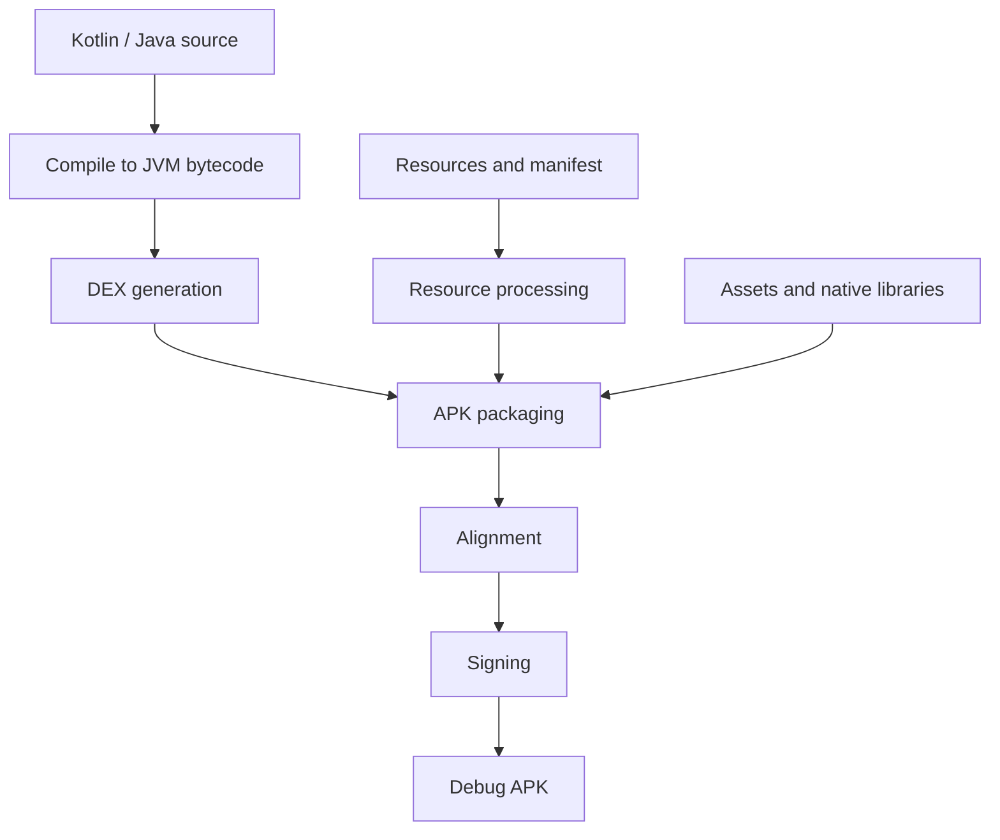

# Gradle and APK build lifecycle — v0.4.3

Android Environment provides SDK installation and optional Build Tools validation. An application repository provides the Gradle Wrapper, AGP configuration, source, resources, and build tasks. This guide explains that boundary; it is not a record of a successful Android Cookbook build.

## Prepare the workstation

From Android Environment:

```bash
make install-sdk
make install-build-tools
make validate-build-tools
```

The validator checks Java availability, the configured Build Tools directory, and three executable tools. It does not establish that an application builds. See [Build Tools](./build-tools.md).

## Gradle lifecycle

Run the Gradle Wrapper from the application repository containing `gradlew`:

```bash
./gradlew assembleDebug
```

The Wrapper selects the project's Gradle distribution. Gradle processes a build in three phases:

| Phase | Purpose |
| --- | --- |
| Initialization | Determine participating projects from settings |
| Configuration | Evaluate build configuration and establish the required task graph |
| Execution | Run selected tasks and their dependencies |

This is Gradle's build lifecycle, not a list of Android compilation steps. See the official [Gradle lifecycle guide](https://docs.gradle.org/current/userguide/build_lifecycle.html).

## Android APK pipeline

AGP configures tasks for the application's variants. A simplified debug APK pipeline is:



The exact tasks and tool selection depend on AGP and project settings. Installing SDK Build Tools 36.0.0 does not guarantee that AGP uses every binary in that directory. For example, AGP can obtain AAPT2 through its own dependency resolution; see the [AAPT2 documentation](https://developer.android.com/tools/aapt2).

D8 converts Java bytecode to DEX; release builds can use R8 optimization. Resource processing uses AAPT2. Packaging combines DEX, resources, the manifest, assets, and any native libraries.

When manually using `apksigner`, run `zipalign` before signing. Changes after signing can invalidate the signature. Gradle Android builds handle packaging, alignment, and configured signing through the build tooling. See Google's [apksigner guide](https://developer.android.com/tools/apksigner).

## Build and install

For a typical application module named `app`:

```bash
./gradlew assembleDebug
adb -s emulator-5554 install app/build/outputs/apk/debug/app-debug.apk
```

The output path is an example; flavors, module names, and custom configuration can change it. Select the actual connected serial using `adb devices`. A running emulator is needed for installation, not for building an APK.

Alternatively, from the application repository:

```bash
./gradlew installDebug
```

This builds and installs the debug variant on a connected target. Debug signing is normally configured automatically; production signing requires application-specific configuration. See Google's [command-line build guide](https://developer.android.com/build/building-cmdline).

## Repository coverage

Android Environment v0.4.3 does not execute Gradle, compile an app, produce an APK, or test APK installation. Its Build Tools tests cover Bash helpers with fake files. Its two integration tests check the baseline AVD listing and an online emulator's boot property. Successful environment tests are prerequisites, not proof of a successful application build.
