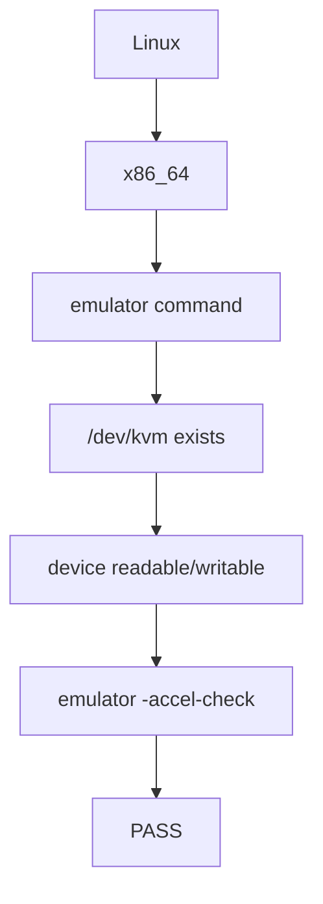

# Linux and KVM

Android Environment v0.4.0 adds Linux/KVM host and acceleration checks. Local emulator lifecycle commands remain available.

## Goal

Before running an Android Emulator on Linux, verify that the workstation can provide hardware-assisted virtualization.

The script checks in this order:



## Requirements

The KVM check is intended for the following host setup; this does not replace the broader macOS/Linux ABI mapping used by SDK provisioning:

* Linux
* x86_64
* Android Emulator
* KVM
* x86_64 Android system images

## Manual Validation

Check the host:

```bash
uname -s
uname -m
```

Expected:

```text
Linux
x86_64
```

Check the KVM device:

```bash
ls -l /dev/kvm
```

Check Android Emulator acceleration:

```bash
emulator -accel-check
```

A successful check should indicate that KVM is installed and usable.

## Project Validation

The Makefile exposes:

```bash
make kvm-check
```

The script validates:

1. The host is Linux.
2. The host architecture is x86_64.
3. Android Emulator is installed.
4. `/dev/kvm` exists.
5. The current user can read and write `/dev/kvm`.
6. Android Emulator reports that acceleration is available.

## KVM Device

Linux exposes KVM through:

```text
/dev/kvm
```

The existence of this device indicates that the KVM interface is available to userspace.

Existence alone is not sufficient. The current user also needs permission to access the device.

## Emulator Acceleration

Android Emulator provides:

```bash
emulator -accel-check
```

The `emulator_acceleration_available` helper returns the exit status of this command, with output suppressed. The full project check runs it after checking the host, emulator command, and device permissions.

## Troubleshooting

### `/dev/kvm` does not exist

Check whether CPU virtualization support is visible:

```bash
egrep -c '(vmx|svm)' /proc/cpuinfo
```

A value greater than zero indicates that virtualization extensions are visible to Linux.

### Permission denied

Inspect:

```bash
ls -l /dev/kvm
groups
```

The Linux account must have appropriate permission to access the KVM device.

### Emulator acceleration fails

Run:

```bash
emulator -accel-check
```

directly and inspect its diagnostic output.

## Scope and test status

The KVM check is intended to inspect host readiness without starting an emulator. Existing `make emulator-start`, wait, status, stop, and reset commands still operate independently and do not call the KVM check. `make validate` also does not check KVM.

There is no `make headless-smoke` target or `scripts/run_headless_smoke.sh` runner. The reserved CI settings in `config/android.env` are unused; automated headless execution and cleanup are not implemented in this tree.

The 2026-09-22 macOS `make unit-test` run reports **10 passed, 2 deselected**: six emulator helper tests and four KVM mock tests passed. Bash syntax checks also passed. The two integration tests were excluded; neither real Linux/KVM acceleration nor the complete Linux host check was exercised. Device permission checks are not covered by the current mock suite. See [testing](./testing.md) for results and coverage limits, and [configuration](./configuration.md) for active versus unused settings.
